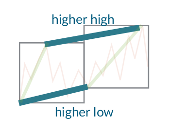
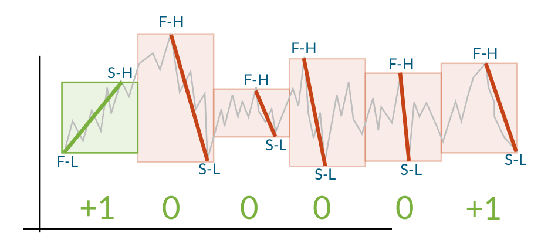
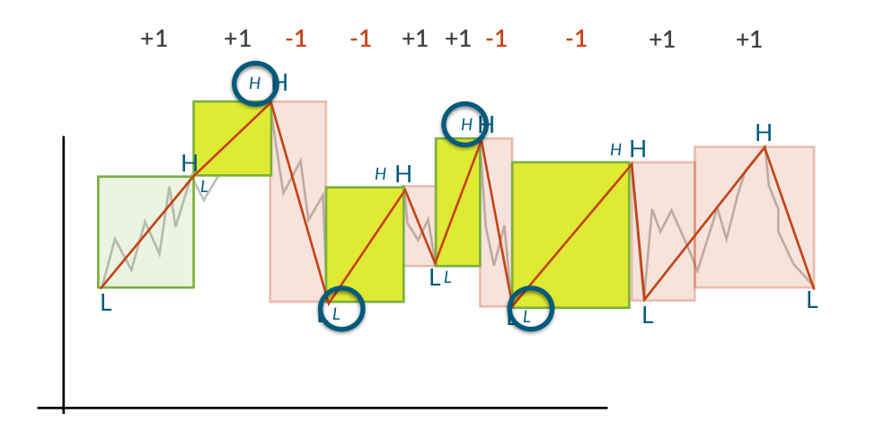
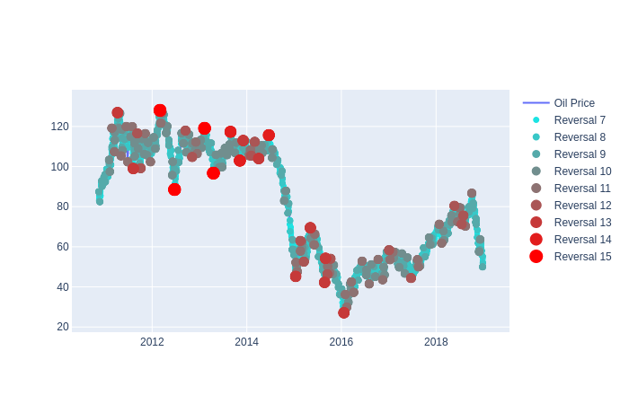

# Spark Trend Calculus Examples

## Introduction to Trend Calculus

Trend Calculus is an algorithm invented by Andrew Morgan that is used to find trend changes in a time series. The images in this section are taken from Morgan's presentation which can be found [here](https://github.com/bytesumo/TrendCalculus/blob/master/HowToStudyTrends_v1.03.pdf).

It works by grouping the observations in the time series into windows and defining a trend upwards as "higher highs and higher lows" compared to the previous window. A downwards trend is similarly defined as "lower highs and lower lows"

If there is a higher high and lower low (or lower high and higher low), no trend is detected. This is solved by introducing intermediate windows that split the non-trend into two trends, ensuring that every point can be labeled with either an up or down trend.

When the trends have been calculated for all windows, the points where the trends change sign are labeled as reversals. If the reversal is from up to down, the previous high is the reversal point and if the reversal is from down to up, the previous low is the reversal. This means that the reversals always are the appropriate extrema (maximum for up to down, minimum for down to up)

The output of the algorithm is a time series consisting of all the labelled reversal points. It is therefore possible to use this as the input for another run of the Trend Calculus algorithm, finding more long term trends.

## Trend Calculus of OIL Price

Example Applications of Trend Calculus in Apache Spark.

Johannes Graner, Albert Nilsson and Raazesh Sainudiin

2020, Uppsala, Sweden

This project was supported by Combient Mix AB through summer internships at:

Combient Competence Centre for Data Engineering Sciences, 
Department of Mathematics, 
Uppsala University, Uppsala, Sweden

### Streaming Example with multiple sources and sinks:

- [notebooks/db/02streamable-trend-calculus](notebooks/db/02streamable-trend-calculus.md)

### A simple Markov Chain model for trend prediction

- [notebooks/db/03streamable-trend-calculus-estimators](notebooks/db/03streamable-trend-calculus-estimators.md)
- ...

# Resources

This builds on the following library and its antecedents therein:

- [https://github.com/lamastex/spark-trend-calculus](https://github.com/lamastex/spark-trend-calculus)

## This work was inspired by:

- Antoine Aamennd's [texata-2017](https://github.com/aamend/texata-r2-2017)
- Andrew Morgan's [Trend Calculus Library](https://github.com/ByteSumoLtd/TrendCalculus-lua)

---
---

[edit on GitHub](https://github.com/lamastex/spark-trend-calculus-examples/edit/master/README.md)
