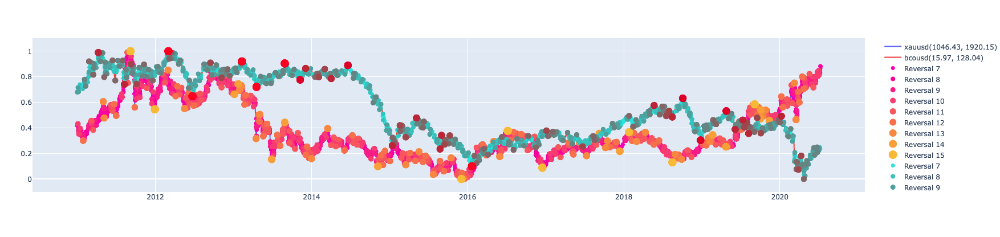
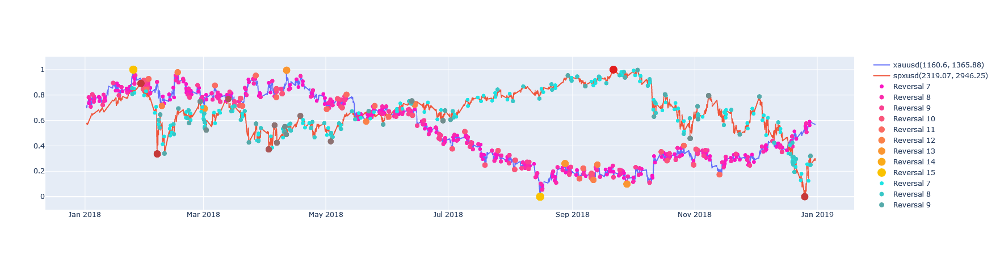

# Spark Trend Calculus Examples

Johannes Graner, Albert Nilsson and Raazesh Sainudiin

2020, Uppsala, Sweden

This project was supported by Combient Mix AB through summer internships at:

Combient Competence Centre for Data Engineering Sciences, 
Department of Mathematics, 
Uppsala University, Uppsala, Sweden

## Introduction to Trend Calculus

Trend Calculus is an algorithm invented by Andrew Morgan that is used to find trend changes in a time series. The images in this section are taken from Morgan's presentation which can be found [here](https://github.com/bytesumo/TrendCalculus/blob/master/HowToStudyTrends_v1.03.pdf).

It works by grouping the observations in the time series into windows and defining a trend upwards as "higher highs and higher lows" compared to the previous window. A downwards trend is similarly defined as "lower highs and lower lows"

If there is a higher high and lower low (or lower high and higher low), no trend is detected. This is solved by introducing intermediate windows that split the non-trend into two trends, ensuring that every point can be labeled with either an up or down trend.

When the trends have been calculated for all windows, the points where the trends change sign are labeled as reversals. If the reversal is from up to down, the previous high is the reversal point and if the reversal is from down to up, the previous low is the reversal. This means that the reversals always are the appropriate extrema (maximum for up to down, minimum for down to up)

The output of the algorithm is a time series consisting of all the labelled reversal points. It is therefore possible to use this as the input for another run of the Trend Calculus algorithm, finding more long term trends.

A more mathematical description of the algorithm can be found [here](https://github.com/lamastex/working-manuscript-trend-calculus).

## Trend Calculus of OIL Price

Example Applications of Trend Calculus in Apache Spark.

### Utility functions for paths in file system

- [notebooks/ScaDaMaLe/000a-finance-utils](notebooks/ScaDaMaLe/000a_finance_utils.md)

### Finding trend in oil price data:

- [notebooks/ScaDaMaLe/01-trend-calculus-showcase](notebooks/ScaDaMaLe/01_trend_calculus_showcase.md)

This is the basic use case of Trend Calculus, reading static financial data and using Trend Calculus to find trend reversals.

### Streaming Example with multiple sources and sinks:

- [notebooks/ScaDaMaLe/02-streamable-trend-calculus](notebooks/ScaDaMaLe/02_streamable_trend_calculus.md)

A slightly different syntax is required to run several iterations of Trend Calculus on a streaming dataframe. Finding the maximum order trend reversal at a given point can not be performed on streaming dataframes.

### A simple Markov Chain model for trend prediction

Here it is also shown that a model can be trained on trend reversals from different time series and yield results that are comparable to training on the same amount of data from a single time series.

- [notebooks/ScaDaMaLe/03-streamable-trend-calculus-estimators](notebooks/ScaDaMaLe/03_streamable_trend_calculus_estimators.md)

As seen in this notebook, the information in the trend reversals contain information that can be used to predict future trends. This should be considered a proof-of-concept to show that trend reversals could be a useful feature in more advanced machine learning models.

## Bivariate Trend Calculus of OIL Price and GOLD ounce in USD

## Bivariate Trend Calculus GOLD ounce and S&P index in USD

# Resources

This builds on the following library and its antecedents therein:

- [https://github.com/lamastex/spark-trend-calculus](https://github.com/lamastex/spark-trend-calculus)

## This work was inspired by:

- Antoine Aamennd's [texata-2017](https://github.com/aamend/texata-r2-2017)
- Andrew Morgan's [Trend Calculus Library](https://github.com/ByteSumoLtd/TrendCalculus-lua)

---
---

[edit on GitHub](https://github.com/lamastex/spark-trend-calculus-examples/edit/master/README.md)
