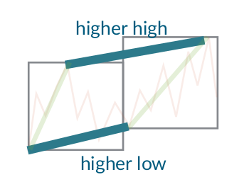

# Spark Trend Calculus Examples

## Introduction to Trend Calculus

Trend Calculus is an algorithm invented by Andrew Morgan that is used to find trend changes in a time series. The images in this section are taken from Morgan's presentation which can be found [here](https://github.com/bytesumo/TrendCalculus/blob/master/HowToStudyTrends_v1.03.pdf).

It works by grouping the observations in the time series into windows and defining a trend upwards as "higher highs and lower lows" compared to the previous window.

## Trend Calculus of OIL Price

Example Applications of Trend Calculus in Apache Spark.

Johannes Graner, Albert Nilsson and Raazesh Sainudiin

2020, Uppsala, Sweden

This project was supported by Combient Mix AB through summer internships at:

Combient Competence Centre for Data Engineering Sciences, 
Department of Mathematics, 
Uppsala University, Uppsala, Sweden

See Streaming Example with multiple sources and sinks:

- [notebooks/db/02streamable-trend-calculus](notebooks/db/02streamable-trend-calculus.md)
- ...
- ...

# Resources

This builds on the following library and its antecedents therein:

- [https://github.com/lamastex/spark-trend-calculus](https://github.com/lamastex/spark-trend-calculus)

## This work was inspired by:

- Antoine Aamennd's [texata-2017](https://github.com/aamend/texata-r2-2017)
- Andrew Morgan's [Trend Calculus Library](https://github.com/ByteSumoLtd/TrendCalculus-lua)

---
---

[edit on GitHub](https://github.com/lamastex/spark-trend-calculus-examples/edit/master/README.md)
